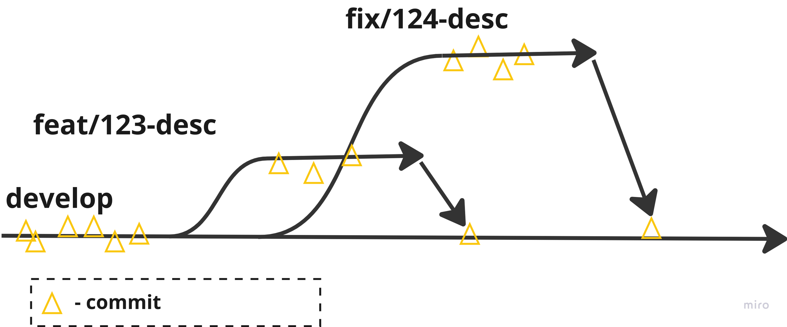
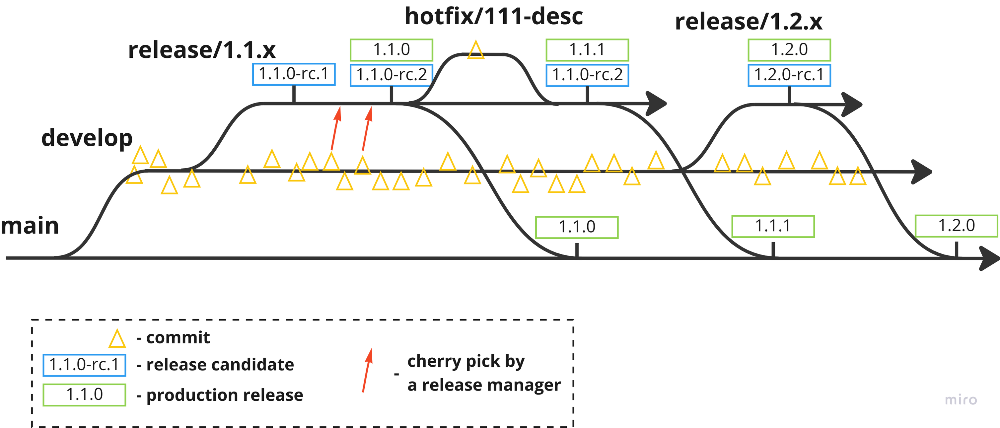

In aeScan we are using a flavor of [Git Flow](https://nvie.com/posts/a-successful-git-branching-model/) as our branching strategy. It is one of the most (if not the most) commonly used git branching strategies. The main branch represents the latest production-ready state of the code. The `develop` branch is containing the latest version of the code, which has been reviewed by the team, but may be unstable. Almost all of the development targeting the `develop` branch is happening on the `feat/*` and `fix/*` branches which after the code review process get merged back into the `develop`. 

To stabilize the code and prepare for a production-ready release, a `release/[VERSION]` branch shall be created.  The preferred way of fixing release issues is reproducing them in the `develop` branch, fixing them there, and cherry-picking by a release manager a fix to the release. If a bug is present in a release branch, but it's not reproducible in the `develop`, a `hotfix/*` branch may be created targeting the specific `release/[VERSION]` branch. 

All Pull Requests should be possibly small and focused on delivering the requested change. Treat refactoring tasks as feature requests. Refrain from implementing side fixes or refactoring inside in `fix/*` branches to allow for easy cherry-picking of these fixes to the release branches. Instead, move the scope requiring a refactor to a separate task. Merge your pull requests by squashing changes into a single PR, otherwise, the automatically-generated changelog will be clouded with chaotic information. For naming the Pull Requests and merge commits always use the conventional commits pattern. Put the id of the issue(s) that the PR resolves in the scope section of a PR e.g. `feat(111): change the description`. If the change you make refers to multiple issues, you can put all IDs separated by a comma e.g. `fix(111,123,444): everything works again`. 